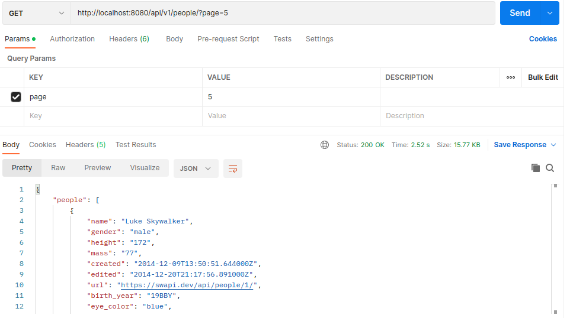
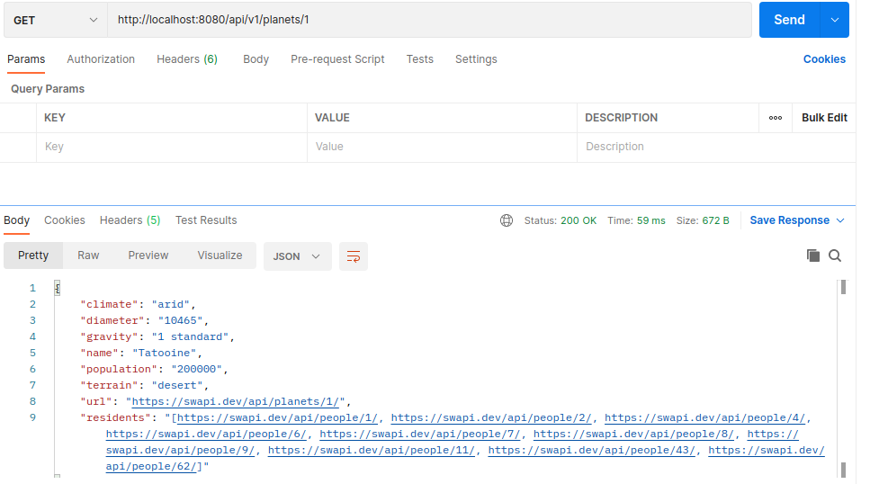

# Java Technical Solutions

## Description
This project allows search planets/people with a specific page and search any planet/people by id

### Pre-requirements 📋
- Java 11 or higher
- Git installed
- GitBash - download in this https://gitforwindows.org/
- Docker and docker compose

## Setup 📦
- Open terminal or cmd
- Clone the project with the command "git clone https://github.com/felipe-ga/java-technical-tests-solutions.git"
- Navigate to folder called "java-technical-tests-solutions" with command "cd java-technical-tests-solutions"
- Run linux command  "./mvnw clean install -DskipTests" or System window Run next command  "mvnw.cmd clean install -DskipTests"
- Run command "docker build -t java-technical-tests-solutions.jar ."
- Run command "docker-compose up -d"
- To restart the microservice, we need to run the next command again "docker-compose up -d"
- To finish the microservice, we need to run the next command again "docker-compose down"

## Documentation
- You can visit documentation for more information about the API in this link
    - http://localhost:8080/swagger-ui.html

## Usage

Find all people

    -  url : http://localhost:8080/api/v1/people/?page=5
    -  http method: GET

Find all planets

    -  url : http://localhost:8080/api/v1/planets/?page=1
    -  http method: GET

Find people by id

    -  url : http://localhost:8080/api/v1/people/3
    -  http method: GET

Find planet by id

    -  url : http://localhost:8080/api/v1/planets/1
    -  http method: GET

Save people

    -  url : http://localhost:8080/api/v1/people/
    -  http method: POST
    -  request:
    {
        "name": "juan",
        "birth_year": "33BBY",
        "eye_color": "red",
        "gender": "male",
        "hair_color": "black",
        "height": "96", 
        "homeworld": "https://swapi.dev/api/planets/8/",
        "mass": "32", 
        "skin_color": "green", 
        "created": "2014-12-10T15:11:50.376000Z", 
        "edited": "2014-12-20T21:17:50.311000Z", 
        "url": "https://swapi.dev/api/people/3/"
    }

    - response
    {
        "name": "juan",
        "gender": "male",
        "height": "96",
        "mass": "32",
        "created": "2014-12-10T15:11:50.376000Z",
        "edited": "2014-12-20T21:17:50.311000Z",
        "url": "https://swapi.dev/api/people/3/",
        "id": 4,
        "birth_year": "33BBY",
        "eye_color": "red",
        "hair_color": "black",
        "homeworld": "https://swapi.dev/api/planets/8/",
        "skin_color": "green"
    }

## Build with 🛠️
- Java
- Spring boot
- Docker
- Junit
- Postgrest
- JPA